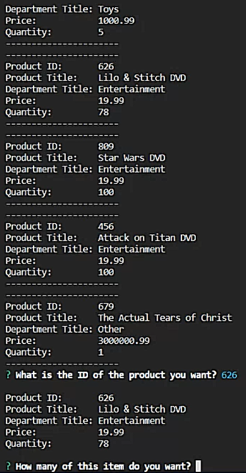
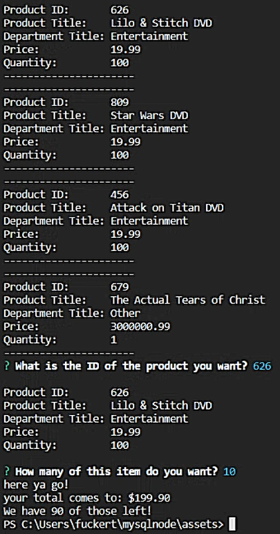
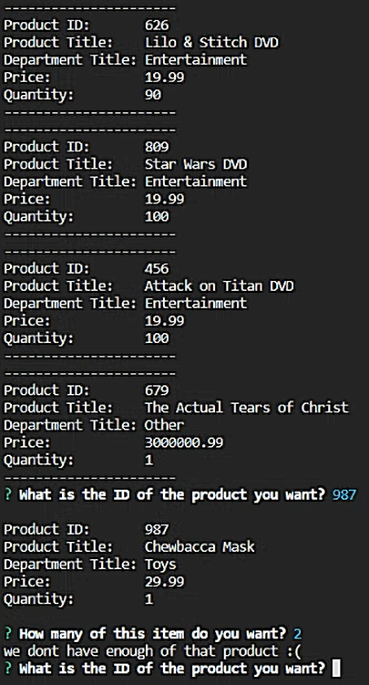
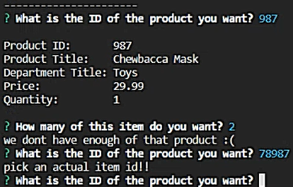

-This app uses input taken in by inquirer, and uses said input to choose an item to buy from a list

-When the app is run, it will list all of the items in the store and ask the user to input an item ID. 

-After an ID is taken in, it lists all of the information about the item chosen. It will then ask the quantity they would like to purchase.

-After the number is input, it will give the user a total for their order, and log how many of that item the store has left.

-The connection kicks out after the user has purchased an item. At that point, running the app again will see the quantity of the table chosen update, and the user has the ability to purchase another item.

-If the user chooses a number higher than the quantity of something we have in stock, an error message is sent to the user, and the app starts over

-Similarly, if a user chooses an item ID that does not exist, the app starts over

link to the github repo!
(https://github.com/Will-25/mysqlnode)